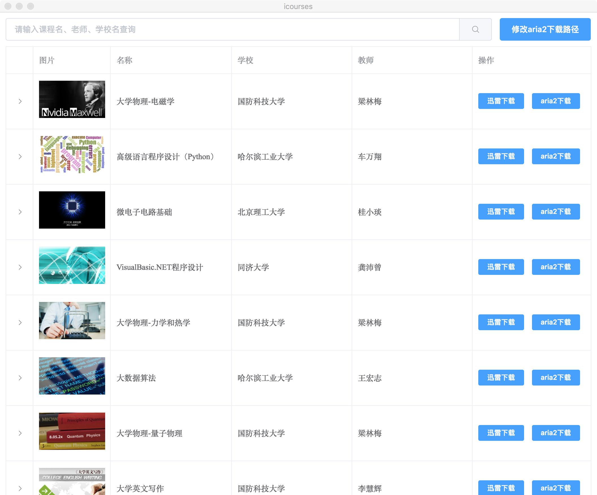

# Icourses

*Icourses* 是一个下载爱课程网视频的工具，支持跨平台，支持下载视频公开课和资源共享课，支持导出迅雷和aria2下载。

### mac用户
由于mac上迅雷暂不支持创建批量任务，推荐使用基于[aria2](https://github.com/aria2/aria2)的[Aria2GUI](https://github.com/yangshun1029/aria2gui)下载, 可以在[https://github.com/yangshun1029/aria2gui/releases](https://github.com/yangshun1029/aria2gui/releases)下载最新版本
### windows用户
1. windows支持最新的迅雷下载，迅雷下载的缺点是只能下载所有视频到同一个目录中，没有章节子目录的划分
2. aria2可以自动建课程章节的目录，并把对应章节下的视频下载到章节目录下，如果你想用aria2下载，推荐使用[Photon](https://github.com/alanzhangzm/Photon/)下载，可以去[https://github.com/alanzhangzm/Photon/releases](https://github.com/alanzhangzm/Photon/releases)下载

# 使用Aria2下载注意事项

1. 使用上面推荐的Aria2 gui下载工具，可以直接下载的
2. 使用Aria2 自建服务器下载， 如果aria2启动配置不一致 可能无法导出aria2下载

```
连接主机
host: localhost
主机端口
port: 6800

secure: false
secret: 

jsonrpc路径
path: /jsonrpc
```

## 安装

最新稳定版: https://github.com/qktechies/icourses/releases

## 截图
**Mac**



## 开发

``` bash
# 安装依赖
npm install

# 启动
npm run dev

# 打包 
npm run build
```


## License
[Apache-2.0](https://github.com/qktechies/icourses/master/LICENSE)

